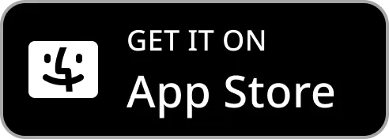

[](https://kotlinlang.org)
[](https://www.jetbrains.com/compose-multiplatform/)


README Language: [中文](/docs/readme/README_CHT.md) | [English](/README.md)

## A Multiplatform Wiki for Zenless Zone Zero

ZZZ Archive is a companion app for the action game Zenless Zone Zero, where users can explore in-game information and browse popular fan-made creations.

## Adaptive Layout


## Download

[](https://play.google.com/store/apps/details?id=com.mrfatworm.zzzarchive)
[](https://github.com/mrfatworm/ZZZ-Archive/releases/latest)
[](https://apps.apple.com/tw/app/zzz-archive/id6738107658)
[](https://apps.microsoft.com/detail/9p5h3ccmzl9z)
[](https://apps.apple.com/tw/app/zzz-archive/id6738107658)

## UI Design

[](https://www.figma.com/community/file/1441663496302710815/zzz-archive)

## Kanban (Realtime)

[](https://www.figma.com/design/j8DMjEOYnDhlDrablx4JYZ/Kanban-ZZZ-Archive?node-id=0-1&t=sLbk3v7npmSm1ZLc-1)

## Design System


## Running on Desktop

```bash
   # Regular run
   ./gradlew run
   
   # Hot reload development
   ./gradlew runHot
   ```

## Contributing

- We welcome contributions! Please see our [Contributing Guide](CONTRIBUTING.md) for detailed
  information
- UI/UX design contribution... (Coming soon)
-

## Library

Thanks to all the contributors who made KMP/CMP possible!
- Kotlin Multiplatform (KMP)
- Compose Multiplatform (CMP)
- JetBrains Adaptive Layout
- JetBrains Navigation Compose
- JetBrains Lifecycle ViewModel
- JetBrains Compose Hot Reload
- Androidx Room Database
- Androidx DataStore
- Koin
- Ktor
- Coil
- BuildKonfig
- Okio I/O

## Localization Support

- English
- Traditional Chinese

## Special Thanks

- Resources from [Zenless Zone Zero](https://zenless.hoyoverse.com/) and [Zenless Zone Zero Wiki](https://zenless-zone-zero.fandom.com/wiki/Zenless_Zone_Zero_Wiki)
- [Philipp Lackner’s YouTube Channel](https://www.youtube.com/@PhilippLackner)
- [JetBrains KMP Guidelines](https://www.jetbrains.com/help/kotlin-multiplatform-dev/get-started.html)
- [Android Developer Guidelines](https://developer.android.com/)
- [Android Open Source Project](https://github.com/android)
- [Compose Multiplatform Wizard](https://github.com/terrakok/Compose-Multiplatform-Wizard)
- [BuildKonfig for KMP](https://sujanpoudel.me/blogs/managing-configurations-for-different-environments-in-kmp/)
- [Release macOS App](https://www.marcogomiero.com/posts/2024/compose-macos-app-store/)
- [Design System](https://github.com/felipecastilhos)